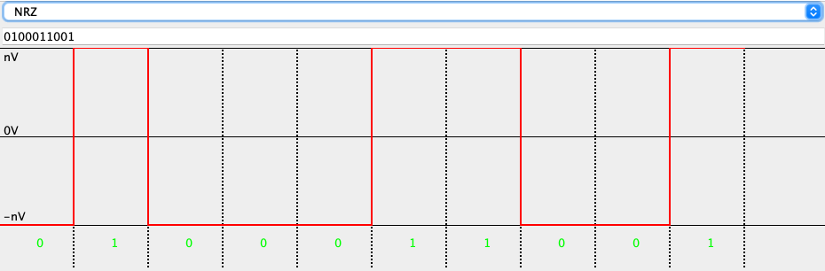
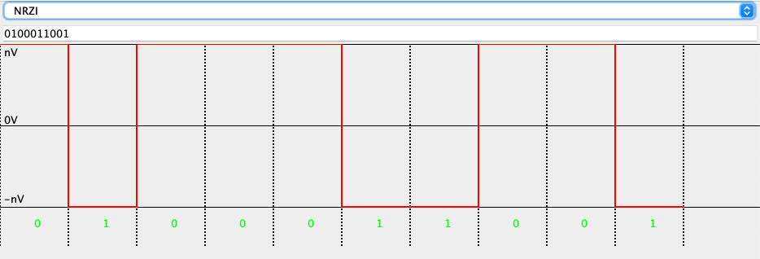
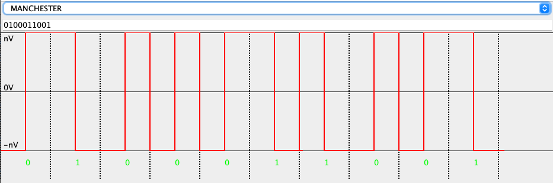
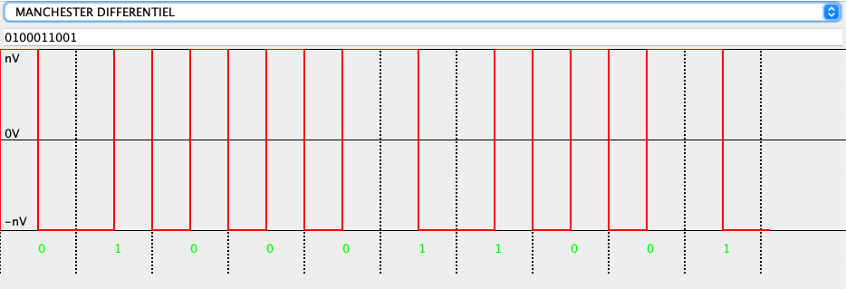
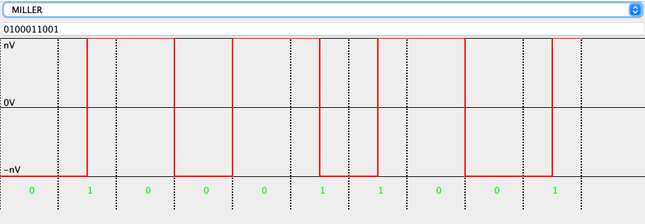

# signal-visualizer
Visualize the electric signal emitted with given bits and different codes (Manchester, Miller etc).

## Install
- Clone this repo
- Open it in your IDE
- Execute (or make a jar, or do whatever you want)

## How does it work
- Select your code : NRZ, NRZI, Manchester, Differential Manchester, Miller
- Write your bits in the text field
- Visualize the electric signal in the second half of the menu

## Examples

Example bits : 0100011001
- NRZ

- NRZI

- Manchester

- Differential Manchester

- Miller

